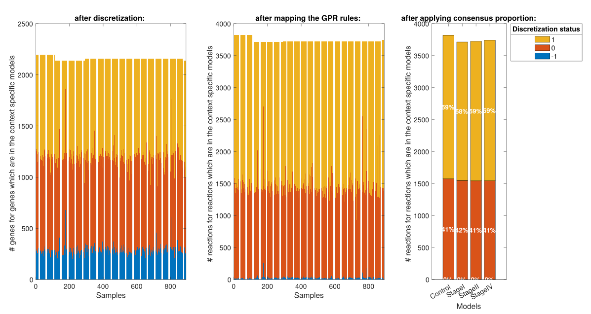
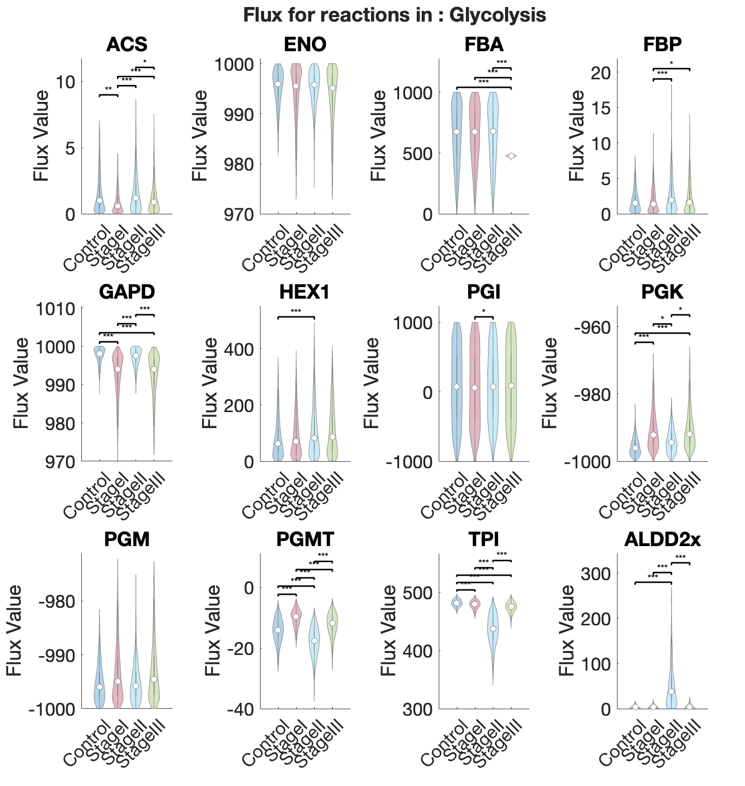

# Model Comparison

The `modelComparison` function compares multiple context-specific models built from the same reference model. It runs a set of comparative analyses and stores the results under a dedicated `comparisons` field in the project structure.

## Prerequisites

!!! warning "Single model analysis required"
    `singleModelAnalysis` must have been run on all models included in the comparison, and the **active analysis** must have been set for each model using `chooseActiveAnalysisForComparison`. The active analysis provides the FBA, FVA, and sampling results used by the functional and sampling comparisons.

### Choosing the active analysis

Since multiple analysis runs (with different parameters) can coexist on the same model, the `chooseActiveAnalysis` function must be called before running `modelComparison`. It designates which analysis run to use for each model in the comparison by copying it into an `active` slot under `project.models.<modelName>.analysis.active`. This way, downstream comparison functions can access results without needing to know the exact analysis ID for each model.

```matlab
[project, activeAnalysisTable] = chooseActiveAnalysis(project, modelList, analysisIDs, overwriteActive)
```

#### Input arguments

| Name | Type | Description | Default |
|---|---|---|---|
| `project` | `struct` | Project structure with completed single model analyses | required |
| `modelList` | `cell array` | Names of the models to define an active analysis for | required |
| `analysisIDs` | `cell array` | Analysis ID to set as active for each model (same order as `modelList`) | `{}` (most recent) |
| `overwriteActive` | `cell array` | Fields to overwrite in the existing active slot, or `{'all'}` for full replacement | `{'all'}` |

#### Output

| Name | Type | Description |
|---|---|---|
| `project` | `struct` | Project with `active` analysis defined for each model |
| `activeAnalysisTable` | `table` | Summary of the active analysis IDs used per model |

#### Behavior

- **No `analysisIDs` provided** — the most recent analysis (by timestamp) is automatically selected for each model.
- **`overwriteActive = {'all'}`** (default) — the entire `active` slot is replaced with the chosen analysis. All previous active results are discarded.
- **`overwriteActive = {'FBA', 'FVA', ...}`** — only the specified fields are replaced in the active slot. Other fields (e.g. `sampling`) are preserved. The `parameters` table is automatically merged: rows corresponding to the overwritten analyses are replaced, while rows for other analyses are kept.

!!! tip "Selective overwrite"
    If you want to update only the FBA results in the active analysis while keeping the existing sampling results, use `overwriteActive = {'FBA'}` instead of `{'all'}`. This avoids re-running the entire analysis pipeline.

#### Usage example

```matlab
% Use the most recent analysis for each model
[project, activeTable] = chooseActiveAnalysis(project, {"model1", "model2"});

% Specify explicit analysis IDs
[project, activeTable] = chooseActiveAnalysis(project, {"model1", "model2"}, ...
    {"analysis_20240815_1430", "analysis_20240816_0900"});

% Selectively overwrite only FBA in the active slot
[project, activeTable] = chooseActiveAnalysis(project, {"model1"}, ...
    {"analysis_20240815_1430"}, {'FBA'});
```

## Comparison types

Three types of comparison are available, each investigating a different aspect of the models:

| Comparison | Key | Description |
|---|---|---|
| Structural | `structuralComparison` | Compares the presence or absence of reactions, metabolites, and genes across models. Includes Jaccard similarity, core reaction retention, and pathway-level reaction presence. Always run first — it is a prerequisite for the other two. |
| Functional | `functionalComparison` | Compares the functional capacity of the models based on FBA and FVA results. Includes objective function values, exchange reaction fluxes, FVA similarity heatmaps, pathway enrichment for dissimilar reactions, and flux sum heatmaps per pathway. |
| Sampling | `samplingComparison` | Compares the sampling solution spaces of the models. Includes ordered sample matrices, inter-model KL divergence (if available), and flux sum heatmaps from sampling distributions. Requires that sampling has been performed on all compared models. |

!!! note "Structural comparison is mandatory"
    The structural comparison is always run, even if only `functionalComparison` or `samplingComparison` is requested. If a comparison with the same name and reference model already exists and the structural analysis has already been completed, it is not re-run — only the newly requested analyses are performed.

## Function signature

```matlab
[project, comparisonName] = modelComparison(project, modelList, referenceModel, identifier, analyses)
```

### Input arguments

| Name | Type | Description | Default |
|---|---|---|---|
| `project` | `struct` | Project structure with single model analyses completed | required |
| `modelList` | `string array` | Names of the models to compare | required |
| `referenceModel` | `string` | Name of the reference model used to compute relative reaction presence | required |
| `identifier` | `string` | Postfix appended to the comparison name | current timestamp (`_yyyyMMdd_HHmmss`) |
| `analyses` | `string array` | Analyses to perform (subset of `structuralComparison`, `functionalComparison`, `samplingComparison`, `IDAREoutput`) | `"structuralComparison"` |

### Output

| Name | Type | Description |
|---|---|---|
| `project` | `struct` | The input project with a `comparisons` field added |
| `comparisonName` | `string` | Name of the created comparison |

## Comparison naming

The comparison name is built from the ordered list of compared models joined by `_vs_`, followed by the identifier:

```
model1_vs_model2_vs_model3__20240815_1430
```

Models are ordered according to their order of appearance in `project.models`, not the order in which they are passed to the function. This ensures consistent naming regardless of the input order.

## Result storage

All comparison results are stored under:

```matlab
project.comparisons.(comparisonName)
```

The following fields are populated:

| Field | Description |
|---|---|
| `modelNames` | Ordered list of compared model names |
| `referenceModel` | Name of the reference model used |
| `structuralComparison` | Structural comparison results and plots |
| `structuralAnalysisStatus` | Flag indicating whether structural analysis has been run (`1` = done) |
| `functionalComparison` | Functional comparison results and plots (if requested) |
| `samplingComparison` | Sampling comparison results and plots (if requested) |
| `comparedAnalysisID` | Table mapping each model to the analysis ID used for the comparison |

## Overwriting behavior

If a comparison with the same name already exists:

- **Same reference model** and structural analysis already run — only the newly requested analyses are performed; the structural comparison is reused.
- **Different reference model** — a warning is issued and the user is prompted to confirm overwriting. Answering `n` aborts the operation. To create a separate comparison instead, use a different `identifier`.

## Example Comparative Analysis 

### Running the comparative metabolic model comparison

In the following, we are going to work with a breast cancer dataset to demonstrate how TackleMMe can be used to explore metabolic models.

The bulk RNA-seq data on which the models are based can be found [here](https://portal.gdc.cancer.gov/projects/TCGA-BRCA). The samples in this dataset were obtained from breast cancer patients at different stages of the disease. For the purpose of this tutorial, the patient samples were divided according to their disease stage. The comparative analysis performed in the following sections is therefore intended to provide initial insights into the metabolic differences associated with breast cancer disease progression.

> The models shown here were generated based on data generated entirely by the TCGA Research Network: https://www.cancer.gov/tcga.

The prerequisites are that the Project Initialization and Single Model Analysis have been run beforehand. Let's walk through this example step by step.

The Single Model Analysis function added analysis slots to our models, which can be found here:


```{matlab}
BRCAProject
 -> models
    -> StageI
        -> analysis
    -> StageII
        -> analysis
  ...
```

To see which analyses are available for each model, you can visualize the analysis object:

```{matlab}
BRCAProject.models.StageI.analysis
```

Let's choose the analyses we want to compare with one another first.

```{matlab}
initCobraToolbox();
changeCobraSolver('gurobi');
feature astheightlimit 2000;

dataPath = "path/to/ProjectObject";
load(dataPath + filesep +'BRCAProjectNo3.mat')

modelsToCompare = {'Control', 'StageI', 'StageII', 'StageIV'};
[BRCAProject, analysisIDs] = chooseActiveAnalysis(BRCAProject, modelsToCompare);

```

The only thing that has changed in our `BRCAProject` is that the analysis of all the models defined in `modelsToCompare` now has an active analysis slot. The data in this slot will be used in the following steps to perform the comparative analysis.

So, let's perform the comparative analysis next:

```{matlab}

% we define which model in our project.models slot is the model that was used to generate the context specific models from
referenceModel = "consistentMediumConstrainedModel"; 
% define which of the analysis you want to perform, by default the structuralComparison is always performed
comparisonList = ["structuralComparison", "functionalComparison", "samplingComparison"];

compID = "tutorial_BRCA_TackleMMe"; 

% this needs to be done since in the cobratoolbox there is already a function named modelComparison
rmpath("local/path/to/cobratoolbox/papers/2025_bioenergeticPD")

% and this is our main comparison function
[BRCAProject, comparisonName] = modelComparison(BRCAProject, modelsToCompare, referenceModel, compID, comparisonList);

```

This might take some time, depending on which comparisons are run. While the structural and functional comparisons are relatively quick, the `samplingComparison` can take some time to compute.

Here are some additional examples of how the function can be used:

```{matlab}
% Run only the structural comparison (default)
[project, compName] = modelComparison(project, ...
    ["model1", "model2", "model3"], "model1");

% Run structural and functional comparisons with a custom identifier
[project, compName] = modelComparison(project, ...
    ["model1", "model2"], "model1", "batchA", ...
    ["structuralComparison", "functionalComparison"]);

% Run all three comparisons
[project, compName] = modelComparison(project, ...
    ["model1", "model2", "model3"], "model1", "fullRun", ...
    ["structuralComparison", "functionalComparison", "samplingComparison"]);
```


### Downstream Investigation of the Metabolic Modelling Comparison

After running the pipeline, there are two main steps left in this tutorial:

+ **Default:** Checking the visualizations that are generated by default by the pipeline
+ **Exploration:** Generating additional figures using the pipeline functions for a more in depth exploration

#### Visualizations Created by Default by TackleMMe

The visualizations created by default serve two main purposes:

1. **Quality Control:** Are the imports and exports reasonable, and does the difference in objective value make sense for the different models?
2. **Determining pathways of interest:** Identifying pathways that may be of interest for further investigation.


__Quality Control:__ 

Growth rate in our models: 

```{matlab}
showFigure(BRCAProject.comparisons.(comparisonName).functionalComparison.plots.objValue)
```


<figure>
    
    <figcaption><strong>Figure1:</strong> Objective value obtained from FBA.</figcaption>
</figure>


As expected, cancer cells proliferate more compared to the Control model.

The next question is: On what does the model grow/what does it produce ?

=== "Import of metabolites"

    <figure>
        
        <figcaption><strong>Figure2:</strong> Flux values for the exchange reactions in the FBA solution. All reactions are shown that have a negative value in at least one of the models.</figcaption>
    </figure>

=== "Export of metabolites"

    <figure>
        
        <figcaption><strong>Figure3:</strong> Flux values for the exchange reactions in the FBA solution. All reactions are shown that have a positive value in at least one of the models.</figcaption>
    </figure>

 


For models generated with `rFASTCORMICS_v2`, there are additional QC metrics to consider:

+ How was our gene expression data discretized?
+ How does this translate to the discretization at the reaction level?
+ How many of the reactions are defined as active in each model?


=== "Gene/Rxn discretization per sample and model"

    `showFigure(BRCAProject.comparisons.(comparisonName).structuralComparison.plots.dataDiscretization)`
    
    <figure>
        
        <figcaption><strong>Figure4:</strong> Discretization Values for all genes per sample(left)/rxns per samples(middle)/rxns per model(right) for the genes/rxns that made it into the models.</figcaption>
    </figure>

    Here, you want a substantial proportion of your genes (left) and reactions (middle) to be discretized as 1. If you observe a high percentage of genes being discretized as -1 (e.g., 80% being -1), then something may have gone wrong during the discretization. In this case, you should go back and check the discretization figures generated by `discretizeFPKM.m` (see the code [here](https://github.com/sysbiolux/rFASTCORMICS/blob/master/rFASTCORMICS%20for%20RNA-seq%20data/rFASTCORMICS_v2/scripts/rFASTCORMICS/discretizeFPKM.m)), which is run as part of Tutorial Script No. 1 (see [here](https://github.com/sysbiolux/TackleMMe/blob/main/BRCAexample/no1_modelBuildingAndProjectInit.m)).
    The percentage of reactions assigned to each discretization status for each model (right subfigure) is influenced by both the reaction mapping (middle figure) and the applied consensus proportion. The consensus proportion defines the percentage of samples that need to have a value of 1 for a reaction to be categorized as a core (1) reaction. Therefore, if the percentage of reactions classified as 1 is low in the right subfigures, you can go back and apply a different consensus proportion. The default value is 90%.


=== "Core reactions in the Model"

    `showFigure(BRCAProject.comparisons.(comparisonName).structuralComparison.plots.coreReactions)`

    <figure>
        
        <figcaption><strong>Figure5:</strong> Core vs non-core reactions that made it into the model(upper left). Number of reactions that were categorized as core and were included/not included into the model (upper right). Number of rxns that are overlapping between the different model (bottom).</figcaption>
    </figure>

    The behaviour of the models generated by rFastcormicsv2 are heavily dependend on the definition of the core reactions. Therefore two interesting metrics to look at are: 

    1. How many of the rxns in a model are core reactions ? -> left upper figure
    2. How many of the rxns that were defined to be core reactions made it into the model ? -> right upper figure

    Optimally, we would like all of our core reactions to be included in our models, but in reality, this is not the case.
    Therefore, a trade-off between the size of the models and the number of core reactions included needs to be found.
    The more core reactions that are included in the model, the larger the model becomes, since forcing all core reactions into the model requires additional non-core reactions to be added in order to maintain model consistency.
    The overlap of the core reactions between the models is shown in the lower plot.
    Since the core reactions heavily influence the construction of the model (in addition to the medium), this figure provides a first impression of the extent of the differences between the models. In particular, it gives an indication of how many reactions are responsible for the overall structural differences observed between the models.


=== "Core reactions in Pathways"

    `showFigure(BRCAProject.comparisons.(comparisonName).structuralComparison.plots.coreReactionsIntersections)`

    <figure>
        
        <figcaption><strong>Figure6:</strong> Stacked Barplot showing the subsystems which the inter and outersections seen in Figure 5 are from.</figcaption>
    </figure>
    After seeing how large the intersections and differences between the core reactions in the different models are, the next question is which pathways those reactions are part of. Therefore, the x-axis lists all the intersections and differences, while the nested bar plot shows which subsystems the core reactions belong to.
    The key question here is: **Are these interesting subsystems, or do they mainly consist of transport reactions?**


__Structural Model Comparison:__

After making sure that the QC metrics of our models look good, let's move on to take a closer look at what makes our models structurally different.

**Intersection between models in absolute numbers:**


=== "genes in the model"

    `showFigure(BRCAProject.comparisons.(comparisonName).structuralComparison.plots.intersections.genes)`

    <figure>
        
        <figcaption><strong>Figure7:</strong> Inter and outersection of genes between the models. </figcaption>
    </figure>


=== "rxns in the model"

    `showFigure(BRCAProject.comparisons.(comparisonName).structuralComparison.plots.intersections.rxns)`

    <figure>
        
        <figcaption><strong>Figure8:</strong> Inter and outersection of reactions between the models.</figcaption>
    </figure>

=== "metabolites in the model"

    `showFigure(BRCAProject.comparisons.(comparisonName).structuralComparison.plots.intersections.mets)`
    <figure>
        
        <figcaption><strong>Figure9:</strong> Inter and outersection of metabolites between the models.</figcaption>
    </figure>


Similarity between the model defined by the Jaccard Similarity (1-Jaccard Distance):

=== "genes in the model"

    `showFigure(BRCAProject.comparisons.(comparisonName).structuralComparison.plots.jaccardDist.genes)`
    <figure>
        
        <figcaption><strong>Figure10:</strong> Jaccard similarity between models, based on gene presence. </figcaption>
    </figure>


=== "rxns in the model"

    `showFigure(BRCAProject.comparisons.(comparisonName).structuralComparison.plots.jaccardDist.rxns)`
    <figure>
        
        <figcaption><strong>Figure11:</strong> Jaccard similarity between models, based on gene presence.</figcaption>
    </figure>

=== "metabolites in the model"

    `showFigure(BRCAProject.comparisons.(comparisonName).structuralComparison.plots.jaccardDist.mets)`
    <figure>
        
        <figcaption><strong>Figure12:</strong> Jaccard similarity between models, based on gene presence.</figcaption>
    </figure>

The hierarchical clustering shows that the cancer samples cluster together, as expected.

Next, the overlap between the models per subsystem is shown using both absolute values (numbers displayed in the tiles) and relative values (tile coloring), in the context of the pathway size (`#rxns`):

`showFigure(BRCAProject.comparisons.(comparisonName).structuralComparison.plots.reactionPathwayPresence)`
<figure>
    
     <figcaption style="width: 100%; text-align: center;">
    <strong>Figure13:</strong> Overview of reaction (`rxn`) presence and overlap per subsystem and model. On the left, the number of reactions per subsystem in the reference model is shown. On the right, the color coding gives an impression of how many of the reactions from the reference model are retained in the four context-specific models. The numbers indicate the absolute number of reactions in each subsystem for each model.The subsystems with the greatest variance in the absolute number of reactions between the models are displayed at the top. This gives us an impression of the extent of the changes between the models, both in terms of the absolute number of reactions and relative to the size of each subsystem.</figcaption>
</figure>

In this figure that shows the count of rxns per subsystem, we see that the 

__Functional Model Comparison:__

The functional comparison answers the following questions:

+ How different are the FVA boundaries between the models?
+ Are there differences in reaction/metabolite usage (Fluxsum) per subsystem between the models?
+ Are there differences in reaction usage (cardinality) per subsystem between the models?


=== "Similarity of FVA boundaries"

    `showFigure(BRCAProject.comparisons.(comparisonName).functionalComparison.plots.fvaSim.overall)`

    <figure>
        
        <figcaption><strong>Figure14:</strong> Similarity based on the FVA boundaries.</figcaption>
    </figure>

=== "Usage of Rxns (Fluxsum) per Subsystems per Model"

    `showFigure(BRCAProject.comparisons.(comparisonName).functionalComparison.plots.fba.heatmapRxnFluxsum)`

    <figure>
        
        <figcaption><strong>Figure15:</strong> Fluxsum over all reactions per subsystem and model. Baed on fluxes of FBA solution. </figcaption>
    </figure>

=== "Usage of Mets (Fluxsum) per Subsystems per Model"

    `showFigure(BRCAProject.comparisons.(comparisonName).functionalComparison.plots.fba.heatmapMetsFluxsum)`

    <figure>
        
        <figcaption><strong>Figure16:</strong> Fluxsum over all metabolites per subsystem and model. Based on fluxes of FBA solution.</figcaption>
    </figure>

=== "Usage of Rxns (Cardinality) per Subsystem per Model"

    `showFigure(BRCAProject.comparisons.(comparisonName).functionalComparison.plots.fba.heatmapRxnActivityFba)`

    <figure>
        
        <figcaption><strong>Figure17:</strong> Visualization of the Cardinality per subsystem and model. Based on the Cardinality in FBA solution.</figcaption>
    </figure>

These figures show that the TCA cycle is more active in the Stage I and Stage II models compared to the Control and Stage IV models. This pattern is consistent across Fluxsum of metabolites/reactions and Cardinality.

__Sampling Comparison:__

The sampling comparison investigates the broader solution space using flux sampling (by default, CHRR). Unlike FVA, which compares maximum and minimum flux capacities, sampling also assesses the likelihood and stability of different flux values within the feasible solution space.

Since less than half of the reactions are active in the FBA solution, FBA may provide limited insight into subsystems that are inactive when optimizing for the biomass_reaction. Sampling under a biomass constraint (by default, 90% of the biomass upper bound) therefore provides a broader view of the metabolic model and the stability of the flux values observed in the FBA solution.

=== "Fluxsum over Rxns per model"

    `showFigure(BRCAProject.comparisons.(comparisonName).samplingComparison.plots.heatmapRxnFluxSum)`

    <figure>
        
        <figcaption><strong>Figure18:</strong> Average of Fluxsum over all reaction in the subsystem and model. Based on the sampling solutions.</figcaption>
    </figure>

=== "Fluxsum over Rxns per sample"

    `showFigure(BRCAProject.comparisons.(comparisonName).samplingComparison.plots.heatmapRxnFluxSumSamples)`

    <figure>
        
        <figcaption><strong>Figure19:</strong> Fluxsum over all reactions in the subsystem and sample. Based on the sampling solutions.</figcaption>
    </figure>

=== "Fluxsum over Mets per model"

    `showFigure(BRCAProject.comparisons.(comparisonName).samplingComparison.plots.heatmapMetsFluxSum)`

    <figure>
        
        <figcaption><strong>Figure20:</strong> Average of Fluxsum over all metabolites in the subsystem and model. Based on the sampling solutions.</figcaption>
    </figure>

=== "Fluxsum over Mets per Sample"

    `showFigure(BRCAProject.comparisons.(comparisonName).samplingComparison.plots.heatmapMetsFluxSumSamples)`

    <figure>
        
        <figcaption><strong>Figure21:</strong> Fluxsum over all metabolites in the subsystem and sample. Based on the sampling solutions.</figcaption>
    </figure>

Going through the Fluxsum heatmaps generated from the sampling analysis, we see that the tendency observed for the TCA cycle is not reproduced here. We do not observe the same pattern across the models. This could be due to several reasons, and further investigation may help us understand why.

After looking through all the figures, we have a rough first overview of our model.
As a next step, the exploratory part begins, where we look in more detail at our metabolic models.
This exploratory analysis might be driven by certain pathways of interest for which we want to see whether biological assumptions are supported by the model.
Alternatively, specific pathways might already stand out in the heatmaps we have generated because they show greater differences than others.

#### Exploration of metabolic models using TackleMMe

As established in the previous section we see some interesting tendencies for the TCA cycle. 
Looking at the Fluxsum plots (see Fig. 18), it can be seen that the Citric Acid Cycle tends to have higher values in Stage I, lower values in the Control, and even lower values in the Stage II and Stage IV models. In Fig. 19, we can also see that this difference is consistently observed across the samples. Using the functions provided by TackleMMe, it is easy to take a closer look at the individual pathways.

Taking a closer look at specific subsystems or specific sets of rxns can help to understand why. 

As a first step, we want to obtain the `rxnIDs` of all reactions that are part of the pathways of interest:

```{matlab}
[rxnsMetId, producingMet, matched] = getRxnIDs(BRCAProject, referenceModel, ["Citric acid.*"; "Glycolysis.*"]);

visSingleRxnSamplingDistribution(BRCAProject, comparisonName, rxnsMetId(1), ["TCA"], referenceModel)
```

Flux distribution for all rxns that are part of the defined Rxn Set (here the TCA cycle and the Glycolysis).

=== "Figure1"
    
=== "Figure2"
    
=== "Rxn Table"
    


```{matlab}
[rxnsMetId, producingMet, matched] = getRxnIDs(BRCAProject, referenceModel, ["Citric acid.*"; "Glycolysis.*"]);

visSingleMetSamplingDistribution(BRCAProject, comparisonName, rxnsMetId(1), ["TCA"], referenceModel)
```

Fluxsum distribution for all metabolites that participate in the rxns that are part of the defined Rxn Set (here the TCA cycle and the Glycolysis). This shows you the usage of a given metabolite in a set of rxns.


=== "Figure1"
    
=== "Figure2"
    
=== "Figure3"
    
=== "Figure4"
    
=== "Rxn Table"
    


```{matlab}
[rxnsMetId, producingMet, matched] = getRxnIDs(BRCAProject, referenceModel, ["Citric acid.*"; "Glycolysis.*"]);
visSingleRxnFBA(BRCAProject, comparisonName, rxnsMetId(1), "FVA", false, "thresholdFlux", "none")
visSingleRxnFBA(BRCAProject, comparisonName, rxnsMetId(1), "FVA", true, "thresholdFlux", "none")
```

Visualizing the FVA and FBA values for a given Rxn Set. 

=== "Figure1"
    
=== "Figure2"
    


__getRxnIDs function:__

The getRxnIDs function allows you to step through your network by giving in the subsystems,genes, rxns names you want to visualize. Here a few examples on how to use it: 

```{matlab}

% all rxns that are in the TCA cycle AND associated to SDH.* gene
[rxnsMetId, producingMet, matched] = getRxnIDs(BRCAProject, referenceModel, ["Citric acid.* & ^SDH.*"]);

% all rxns that are in the TCA cycle OR associated to SDH.* gene
[rxnsMetId, producingMet, matched] = getRxnIDs(BRCAProject, referenceModel, ["Citric acid.* | ^SDH.*"]);

% all rxns that are in the TCA cycle AND are connected to a metabolite in the mitochondria
[rxnsMetId, producingMet, matched] = getRxnIDs(BRCAProject, referenceModel, ["Citric acid.* & .*[m.*"]);

% all reaction where the udpg[c], gluside_hs, or g1p[c] participate
[rxnsMetId,producingMet,matched] = getRxnIDs(BRCAProject,referenceModel, ["udpg[c.* | EX_.*gluside_hs.* | g1p[c"]);

% visualize the fluxsum of fadh2 in differen subsystems
[rxnsMetId,producingMet,matched] = getRxnIDs(BRCAProject,referenceModel, ["fadh2[.* & Glycolysis.*","fadh2[.* & Pentose.*",...
                                                                              "fadh2[.* & Arginine and proline.*", "fadh2[.* & Citric acid cycle",...
                                                                              "fadh2[.* & Urea cycle", "fadh2[.* & Oxidative phosphorylation",...
                                                                              "fadh2[.* & Glutamate metabolism", "fadh2[.* & Glutathione metabolism"]);
visDiffMetSetUsageFBA(BRCAProject, comparisonName, rxnsMetId, ["fadh2 in Glycolysis", "fadh2 in PPP", "fadh2 in Argining and Proline metabolism", "fadh2 in TCA", "fadh2 in Urea cycle", "fadh2 in OxPhos", "fadh2 in Gluatamte metabolilsm", "fadh2 in Glutathione metabolism"], referenceModel)

```


Visualization of significanly different rxn distributions: 

For details on the principle see [Galuzzi et al. 2024,Journal of Biomedical Informatics](https://www.sciencedirect.com/science/article/pii/S1532046424000157?via%3Dihub).

```{matlab}
[rxnsMetId, producingMet, matched] = getRxnIDs(BRCAProject, referenceModel, ["Glycolysis.*"]);
visSingleRxnSamplingDistribution(BRCAProject, comparisonName, rxnsMetId(1), ["Glycolysis"], referenceModel, true)

```

<figure>
        
        <figcaption><strong>Figure22:</strong> Statistical test to see whether rxns are significantly different (based on KLDivergence). </figcaption>
</figure>

For more ways on how to use the visualizations to investigate the models see our cheatsheet below:

<figure>
        
        <figcaption><strong>Figure23:</strong> Overview on how to use the functions provided by TackleMMe to explore your models.</figcaption>
</figure>


!!! note "Upcoming features"
    The following are planned for future integration:

    - **IDARE output** — generation of interactive pathway visualizations using the IDARE toolbox
    - **Report generation** — automated PDF report for model comparisons, similar to `writeAnalysisReport` for single model analysis