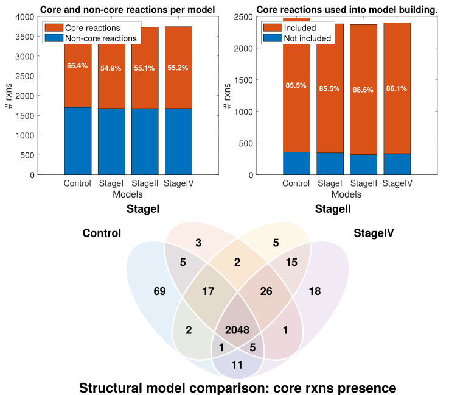
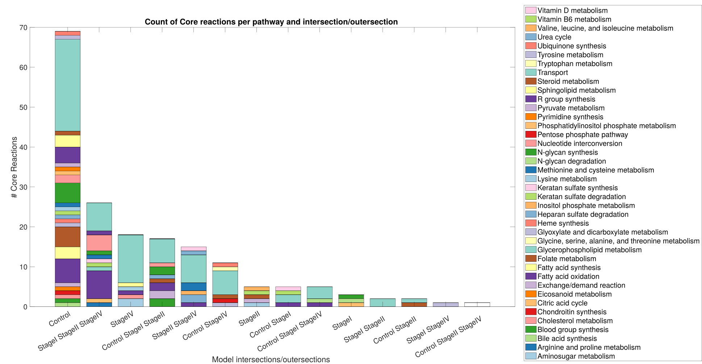
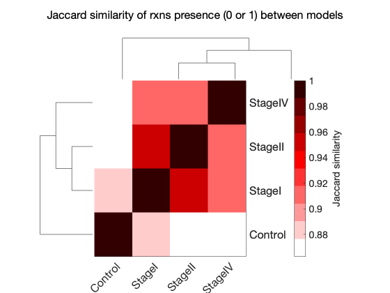
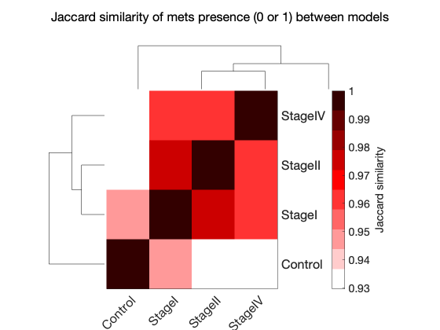
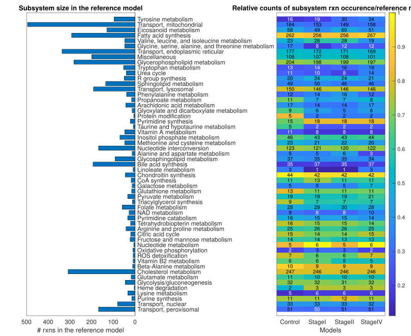
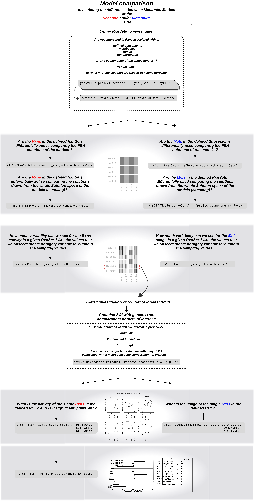

# Model Comparison

The `modelComparison` function compares multiple context-specific models built from the same reference model. It runs a set of comparative analyses and stores the results under a dedicated `comparisons` field in the project structure.

## Prerequisites

!!! warning "Single model analysis required"
    `singleModelAnalysis` must have been run on all models included in the comparison, and the **active analysis** must have been set for each model using `chooseActiveAnalysisForComparison`. The active analysis provides the FBA, FVA, and sampling results used by the functional and sampling comparisons.

### Choosing the active analysis

Since multiple analysis runs (with different parameters) can coexist on the same model, the `chooseActiveAnalysis` function must be called before running `modelsComparison`. It designates which analysis run to use for each model in the comparison by copying it into an `active` slot under `project.models.<modelName>.analysis.active`. This way, downstream comparison functions can access results without needing to know the exact analysis ID for each model.

```matlab
[project, activeAnalysisTable] = chooseActiveAnalysis(project, modelList, analysisIDs, overwriteActive)
```

#### Input arguments

| Name | Type | Description | Default |
|---|---|---|---|
| `project` | `struct` | Project structure with completed single model analyses | required |
| `modelList` | `cell array` | Names of the models to define an active analysis for | required |
| `analysisIDs` | `cell array` | Analysis ID to set as active for each model (same order as `modelList`) | `{}` (most recent) |
| `overwriteActive` | `cell array` | Fields to overwrite in the existing active slot, or `{'all'}` for full replacement | `{'all'}` |

#### Output

| Name | Type | Description |
|---|---|---|
| `project` | `struct` | Project with `active` analysis defined for each model |
| `activeAnalysisTable` | `table` | Summary of the active analysis IDs used per model |

#### Behavior

- **No `analysisIDs` provided** — the most recent analysis (by timestamp) is automatically selected for each model.
- **`overwriteActive = {'all'}`** (default) — the entire `active` slot is replaced with the chosen analysis. All previous active results are discarded.
- **`overwriteActive = {'FBA', 'FVA', ...}`** — only the specified fields are replaced in the active slot. Other fields (e.g. `sampling`) are preserved. The `parameters` table is automatically merged: rows corresponding to the overwritten analyses are replaced, while rows for other analyses are kept.

!!! tip "Selective overwrite"
    If you want to update only the FBA results in the active analysis while keeping the existing sampling results, use `overwriteActive = {'FBA'}` instead of `{'all'}`. This avoids re-running the entire analysis pipeline.

#### Usage example

```matlab
% Use the most recent analysis for each model
[project, activeTable] = chooseActiveAnalysis(project, {"model1", "model2"});

% Specify explicit analysis IDs
[project, activeTable] = chooseActiveAnalysis(project, {"model1", "model2"}, ...
    {"analysis_20240815_1430", "analysis_20240816_0900"});

% Selectively overwrite only FBA in the active slot
[project, activeTable] = chooseActiveAnalysis(project, {"model1"}, ...
    {"analysis_20240815_1430"}, {'FBA'});
```

## Comparison types

Three types of comparison are available, each investigating a different aspect of the models:

| Comparison | Key | Description |
|---|---|---|
| Structural | `structuralComparison` | Compares the presence or absence of reactions, metabolites, and genes across models. Includes Jaccard similarity, core reaction retention, and pathway-level reaction presence. Always run first — it is a prerequisite for the other two. |
| Functional | `functionalComparison` | Compares the functional capacity of the models based on FBA and FVA results. Includes objective function values, exchange reaction fluxes, FVA similarity heatmaps, pathway enrichment for dissimilar reactions, and flux sum heatmaps per pathway. |
| Sampling | `samplingComparison` | Compares the sampling solution spaces of the models. Includes ordered sample matrices, inter-model KL divergence (if available), and flux sum heatmaps from sampling distributions. Requires that sampling has been performed on all compared models. |

!!! note "Structural comparison is mandatory"
    The structural comparison is always run, even if only `functionalComparison` or `samplingComparison` is requested. If a comparison with the same name and reference model already exists and the structural analysis has already been completed, it is not re-run — only the newly requested analyses are performed.

## Function signature

```matlab
[project, comparisonName] = modelsComparison(project, modelList, referenceModel, identifier, analyses)
```

### Input arguments

| Name | Type | Description | Default |
|---|---|---|---|
| `project` | `struct` | Project structure with single model analyses completed | required |
| `modelList` | `string array` | Names of the models to compare | required |
| `referenceModel` | `string` | Name of the reference model used to compute relative reaction presence | required |
| `identifier` | `string` | Postfix appended to the comparison name | current timestamp (`_yyyyMMdd_HHmmss`) |
| `analyses` | `string array` | Analyses to perform (subset of `structuralComparison`, `functionalComparison`, `samplingComparison`, `IDAREoutput`) | `"structuralComparison"` |

### Output

| Name | Type | Description |
|---|---|---|
| `project` | `struct` | The input project with a `comparisons` field added |
| `comparisonName` | `string` | Name of the created comparison |

## Comparison naming

The comparison name is built from the ordered list of compared models joined by `_vs_`, followed by the identifier:

```
model1_vs_model2_vs_model3__20240815_1430
```

Models are ordered according to their order of appearance in `project.models`, not the order in which they are passed to the function. This ensures consistent naming regardless of the input order.

## Result storage

All comparison results are stored under:

```matlab
project.comparisons.(comparisonName)
```

The following fields are populated:

| Field | Description |
|---|---|
| `modelNames` | Ordered list of compared model names |
| `referenceModel` | Name of the reference model used |
| `structuralComparison` | Structural comparison results and plots |
| `structuralAnalysisStatus` | Flag indicating whether structural analysis has been run (`1` = done) |
| `functionalComparison` | Functional comparison results and plots (if requested) |
| `samplingComparison` | Sampling comparison results and plots (if requested) |
| `comparedAnalysisID` | Table mapping each model to the analysis ID used for the comparison |

## Overwriting behavior

If a comparison with the same name already exists:

- **Same reference model** and structural analysis already run — only the newly requested analyses are performed; the structural comparison is reused.
- **Different reference model** — a warning is issued and the user is prompted to confirm overwriting. Answering `n` aborts the operation. To create a separate comparison instead, use a different `identifier`.

## Example Comparative Analysis 

```matlab
% Run only the structural comparison (default)
[project, compName] = modelsComparison(project, ...
    ["model1", "model2", "model3"], "model1");

% Run structural and functional comparisons with a custom identifier
[project, compName] = modelsComparison(project, ...
    ["model1", "model2"], "model1", "batchA", ...
    ["structuralComparison", "functionalComparison"]);

% Run all three comparisons
[project, compName] = modelsComparison(project, ...
    ["model1", "model2", "model3"], "model1", "fullRun", ...
    ["structuralComparison", "functionalComparison", "samplingComparison"]);
```

### Example for comparative Analysis 

In the following we are gonna work on a breast cancer dataset in order to show how TackleMMe can be used to explore metabolic models. 
The leading question is what are the alterations within the metabolism with increasing breast cancer stage ? 

The comparative Analysis function explained in detail in above, is the framework for the comparative analysis, it provides a few default visualizations. Based on these default visualizations + biological questions of interest the following explorative analysis is highly individual, TackleMMe will help you to go through the network and analyze and visualze the differences. 

Before we start, lets look at some QC figures. 

### Quality Control

For the QC we are asking some questions: 

+ How was our gene expression data discretized? 
+ How does it translate to the discretization on rxn level ? 
+ How many of the rxns are defined to be active per model ? 






### Structural Model Comparison


#### Visualizing the outer and intersections between the models

+ overlap between models in absolute numbers:

=== "genes in the model"

    


=== "rxns in the model"

    

=== "metabolites in the model"

    


+ overlap between the models in relative numbers (Jaccard Distance):

=== "genes in the model"

    


=== "rxns in the model"

    

=== "metabolites in the model"

    


+ the overlap between the models per subsystem in absolute & relative numbers:




### Functional Model Comparison

=== "Import of metabolites"

    

=== "Export of metabolites"

    


### Sampling Comparison 


### Explorative model comparison with Tackel MMe




!!! note "Upcoming features"
    The following are planned for future integration:

    - **IDARE output** — generation of interactive pathway visualizations using the IDARE toolbox
    - **Report generation** — automated PDF report for model comparisons, similar to `writeAnalysisReport` for single model analysis