# Model Comparison

The `modelComparison` function compares multiple context-specific models built from the same reference model. It runs a set of comparative analyses and stores the results under a dedicated `comparisons` field in the project structure.

## Prerequisites

!!! warning "Single model analysis required"
    `singleModelAnalysis` must have been run on all models included in the comparison, and the **active analysis** must have been set for each model using `chooseActiveAnalysisForComparison`. The active analysis provides the FBA, FVA, and sampling results used by the functional and sampling comparisons.

### Choosing the active analysis

Since multiple analysis runs (with different parameters) can coexist on the same model, the `chooseActiveAnalysis` function must be called before running `modelComparison`. It designates which analysis run to use for each model in the comparison by copying it into an `active` slot under `project.models.<modelName>.analysis.active`. This way, downstream comparison functions can access results without needing to know the exact analysis ID for each model.

```matlab
[project, activeAnalysisTable] = chooseActiveAnalysis(project, modelList, analysisIDs, overwriteActive)
```

#### Input arguments

| Name | Type | Description | Default |
|---|---|---|---|
| `project` | `struct` | Project structure with completed single model analyses | required |
| `modelList` | `cell array` | Names of the models to define an active analysis for | required |
| `analysisIDs` | `cell array` | Analysis ID to set as active for each model (same order as `modelList`) | `{}` (most recent) |
| `overwriteActive` | `cell array` | Fields to overwrite in the existing active slot, or `{'all'}` for full replacement | `{'all'}` |

#### Output

| Name | Type | Description |
|---|---|---|
| `project` | `struct` | Project with `active` analysis defined for each model |
| `activeAnalysisTable` | `table` | Summary of the active analysis IDs used per model |

#### Behavior

- **No `analysisIDs` provided** — the most recent analysis (by timestamp) is automatically selected for each model.
- **`overwriteActive = {'all'}`** (default) — the entire `active` slot is replaced with the chosen analysis. All previous active results are discarded.
- **`overwriteActive = {'FBA', 'FVA', ...}`** — only the specified fields are replaced in the active slot. Other fields (e.g. `sampling`) are preserved. The `parameters` table is automatically merged: rows corresponding to the overwritten analyses are replaced, while rows for other analyses are kept.

!!! tip "Selective overwrite"
    If you want to update only the FBA results in the active analysis while keeping the existing sampling results, use `overwriteActive = {'FBA'}` instead of `{'all'}`. This avoids re-running the entire analysis pipeline.

#### Usage example

```matlab
% Use the most recent analysis for each model
[project, activeTable] = chooseActiveAnalysis(project, {"model1", "model2"});

% Specify explicit analysis IDs
[project, activeTable] = chooseActiveAnalysis(project, {"model1", "model2"}, ...
    {"analysis_20240815_1430", "analysis_20240816_0900"});

% Selectively overwrite only FBA in the active slot
[project, activeTable] = chooseActiveAnalysis(project, {"model1"}, ...
    {"analysis_20240815_1430"}, {'FBA'});
```

## Comparison types

Three types of comparison are available, each investigating a different aspect of the models:

| Comparison | Key | Description |
|---|---|---|
| Structural | `structuralComparison` | Compares the presence or absence of reactions, metabolites, and genes across models. Includes Jaccard similarity, core reaction retention, and pathway-level reaction presence. Always run first — it is a prerequisite for the other two. |
| Functional | `functionalComparison` | Compares the functional capacity of the models based on FBA and FVA results. Includes objective function values, exchange reaction fluxes, FVA similarity heatmaps, pathway enrichment for dissimilar reactions, and flux sum heatmaps per pathway. |
| Sampling | `samplingComparison` | Compares the sampling solution spaces of the models. Includes ordered sample matrices, inter-model KL divergence (if available), and flux sum heatmaps from sampling distributions. Requires that sampling has been performed on all compared models. |

!!! note "Structural comparison is mandatory"
    The structural comparison is always run, even if only `functionalComparison` or `samplingComparison` is requested. If a comparison with the same name and reference model already exists and the structural analysis has already been completed, it is not re-run — only the newly requested analyses are performed.

## Function signature

```matlab
[project, comparisonName] = modelComparison(project, modelList, referenceModel, identifier, analyses)
```

### Input arguments

| Name | Type | Description | Default |
|---|---|---|---|
| `project` | `struct` | Project structure with single model analyses completed | required |
| `modelList` | `string array` | Names of the models to compare | required |
| `referenceModel` | `string` | Name of the reference model used to compute relative reaction presence | required |
| `identifier` | `string` | Postfix appended to the comparison name | current timestamp (`_yyyyMMdd_HHmmss`) |
| `analyses` | `string array` | Analyses to perform (subset of `structuralComparison`, `functionalComparison`, `samplingComparison`, `IDAREoutput`) | `"structuralComparison"` |

### Output

| Name | Type | Description |
|---|---|---|
| `project` | `struct` | The input project with a `comparisons` field added |
| `comparisonName` | `string` | Name of the created comparison |

## Comparison naming

The comparison name is built from the ordered list of compared models joined by `_vs_`, followed by the identifier:

```
model1_vs_model2_vs_model3__20240815_1430
```

Models are ordered according to their order of appearance in `project.models`, not the order in which they are passed to the function. This ensures consistent naming regardless of the input order.

## Result storage

All comparison results are stored under:

```matlab
project.comparisons.(comparisonName)
```

The following fields are populated:

| Field | Description |
|---|---|
| `modelNames` | Ordered list of compared model names |
| `referenceModel` | Name of the reference model used |
| `structuralComparison` | Structural comparison results and plots |
| `structuralAnalysisStatus` | Flag indicating whether structural analysis has been run (`1` = done) |
| `functionalComparison` | Functional comparison results and plots (if requested) |
| `samplingComparison` | Sampling comparison results and plots (if requested) |
| `comparedAnalysisID` | Table mapping each model to the analysis ID used for the comparison |

## Overwriting behavior

If a comparison with the same name already exists:

- **Same reference model** and structural analysis already run — only the newly requested analyses are performed; the structural comparison is reused.
- **Different reference model** — a warning is issued and the user is prompted to confirm overwriting. Answering `n` aborts the operation. To create a separate comparison instead, use a different `identifier`.

## Example Comparative Analysis 

### Running the comparative metabolic model comparison

In the following we are gonna work on a breast cancer dataset in order to show how TackleMMe can be used to explore metabolic models. 
The bulkRNAseq data the models are based on can be found [here](https://portal.gdc.cancer.gov/projects/TCGA-BRCA). The samples in this dataset stem from Breast cancer patients in different stages of disease. For the purpose of this tutorial the patient samples were split by their disease staging. The comparative analysis performed in the following therefore is meant to give frist insights into the metabolic differences seen due to breast cancer disease progression. 

> The models shown here are generated based on data generated in whole by the TCGA Research Network: https://www.cancer.gov/tcga.

The prerequisits are that the Project Initialization and Single Model Analysis were run beforehand. Let's walk through this example step by step: 

The Single Model Analysis function added analysis slots to our models, which can be found here: 

```{matlab}
BRCAProject
 -> models
    -> StageI
        -> analysis
    -> StageII
        -> analysis
  ...
```

In order to see which analysis are available in each model you can visualize the analysis object: 

```{matlab}
BRCAProject.models.StageI.analysis
```

Let's chooose the analysis we want to compare with one another first. 

```{matlab}
initCobraToolbox();
changeCobraSolver('gurobi');
feature astheightlimit 2000;

dataPath = "path/to/ProjectObject";
load(dataPath + filesep +'BRCAProjectNo3a.mat')

modelsToCompare = {'Control', 'StageI', 'StageII', 'StageIV'};
[BRCAProject, analysisIDs] = chooseActiveAnalysis(BRCAProject, modelsToCompare);

```

The only thing that is change in our BRCAProject now is that the analysis of all the models defined in `modelsToCompare` now have an active analysis slot. The data in this slot wll be used in the following to perform the comparative analysis.

So let's perform the comparative analysis next: 

```{matlab}

% we define which model in our project.models slot is the model that was used to generate the context specific models from
referenceModel = "consistentMediumConstrainedModel"; 
% define which of the analysis you want to perform, by default the structuralComparison is always performed
comparisonList = ["structuralComparison", "functionalComparison", "samplingComparison"];

compID = "tutorial_BRCA_TackleMMe"; 

% this needs to be done since in the cobratoolbox there is already a function named modelComparison
rmpath("local/path/to/cobratoolbox/papers/2025_bioenergeticPD")

% and this is our main comparison function
[BRCAProject, comparisonName] = modelComparison(BRCAProject, modelsToCompare, referenceModel, compID, comparisonList);

```

This might take some time depending on which comparisons are run. While the structural and functional are quite quick, the samplingComparison takes some time to compute.

Here some additional examples on how the function can be used: 

```{matlab}
% Run only the structural comparison (default)
[project, compName] = modelComparison(project, ...
    ["model1", "model2", "model3"], "model1");

% Run structural and functional comparisons with a custom identifier
[project, compName] = modelComparison(project, ...
    ["model1", "model2"], "model1", "batchA", ...
    ["structuralComparison", "functionalComparison"]);

% Run all three comparisons
[project, compName] = modelComparison(project, ...
    ["model1", "model2", "model3"], "model1", "fullRun", ...
    ["structuralComparison", "functionalComparison", "samplingComparison"]);
```


### Downstream Investigation of the metabolic modelling comparison 

After running there are two main steps left in this tutorial: 

+ Checking out the visualizations that are generated by default by the pipeline
+ Generating additional figures with the pipeline function, for a more guided exploration


#### Visualizations created by default by TackleMMe

The Visualizations created by default serve two main purposes: 

1. Quality Control: Is the Import and Export Resonable & does the difference in objective value make sense for my different models ? 
2. Determining Pathways of interest to follow up in more detail


__Quality Control:__ 

Growth rate in our models: 

```{matlab}
showFigure(BRCAProject.comparisons.(comparisonName).functionalComparison.plots.objValue)
```


<figure>
    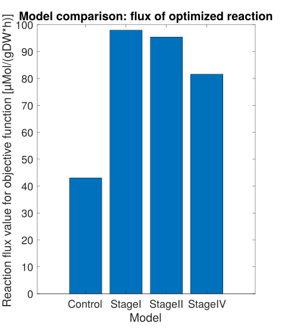
    <figcaption><strong>Figure1:</strong> Objective value obtained from FBA.</figcaption>
</figure>


On what does the model grow/what does it produce ?

=== "Import of metabolites"

    <figure>
        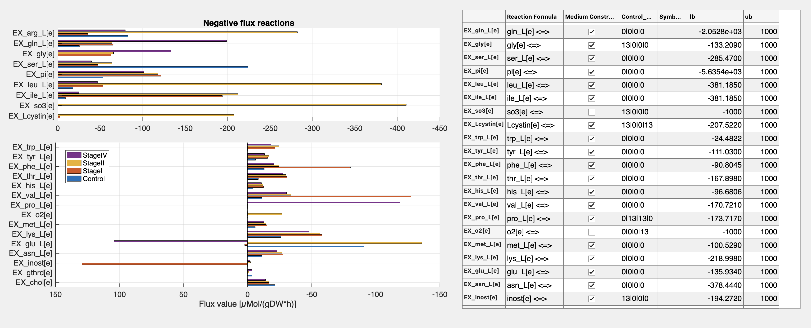
        <figcaption><strong>Figure2:</strong> Flux values for the exchange reactions in the FBA solution. All reactions are shown that have a negative value in at least one of the models.</figcaption>
    </figure>

=== "Export of metabolites"

    <figure>
        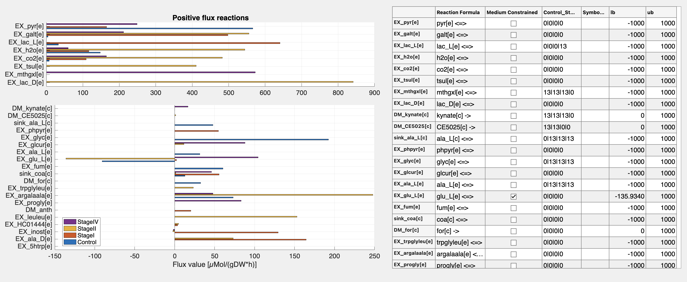
        <figcaption><strong>Figure3:</strong> Flux values for the exchange reactions in the FBA solution. All reactions are shown that have a positive value in at least one of the models.</figcaption>
    </figure>

 

As expected the cancer cells proliferate more compared to the Control model.

For models generated with rFastcormicsv2 there are additional QC metrics to look at

+ How was our gene expression data discretized ? 
+ How does it translate to the discretization on rxn level ? 
+ How many of the rxns are defined to be active per model ? 

=== "Gene/Rxn discretization per sample and model"

    `showFigure(BRCAProject.comparisons.(comparisonName).structuralComparison.plots.dataDiscretization)`
    
    <figure>
        
        <figcaption><strong>Figure4:</strong> Discretization Values for all genes per sample(left)/rxns per samples(middle)/rxns per model(right) for the genes/rxns that made it into the models.</figcaption>
    </figure>

    Here you want to have a good part of your genes(left)/rxns(middle) to be discretized to be 1. If you observe a high percentage of the genes to be discretized as -1 (like 80% being -1) then something went wrong in the discretization. In this case you should go back and check the discretization Figures generated by `discretizeFPKM.m` (see code [here](https://github.com/sysbiolux/rFASTCORMICS/blob/master/rFASTCORMICS%20for%20RNA-seq%20data/rFASTCORMICS_v2/scripts/rFASTCORMICS/discretizeFPKM.m)) which is run as part of tutorial script no1 (see [here](https://github.com/sysbiolux/TackleMMe/blob/main/BRCAexample/no1_modelBuildingAndProjectInit.m)).
    The percentage for the discretization status per rxns for each model (right subfigure) is influenzed by the rxn mapping (middle figure) as well as the applied consensus proportion (percentage of samples that need to be 1 for the rxns to be categorized as core (1) reaction). Therefore if the percentage is low for the right subfigures for the rxns = 1, you can go back to apply a different consensus proportion (default used is 90 percent).

=== "Core reactions in the Model"

    `showFigure(BRCAProject.comparisons.(comparisonName).structuralComparison.plots.coreReactions)`

    <figure>
        
        <figcaption><strong>Figure5:</strong> Core vs non-core reactions that made it into the model(upper left). Number of reactions that were categorized as core and were included/not included into the model (upper right). Number of rxns that are overlapping between the different model (bottom).</figcaption>
    </figure>

    The behaviour of the models generated by rFastcormicsv2 are heavily dependend on the definition of the core reactions. Therefore two interesting metrics to look at are: 

    1. How many of the rxns in a model are core reactions ? -> left upper figure
    2. How many of the rxns that were defined to be core reactions made it into the model ? -> right upper figure

    Optimally we would like all our core reactions to be in our model, but in reality this is not the case. Here a tradeoff between the size of the models and the number of core reactions included needs to be found. The more core rxns included in the model the bigger the model gets, since to force in all the core reactions, more non-core rxns need to be added in order to make the model consistent. 
    The overlap of the core reactions between the models is shown in the lower plot. Since the core reactions influence the construction of the model heavily (besides the medium), this figure gives a first impression on how big the outersections between the models are, so an impression on how many reactions are responsible for the overall structural difference we see in our models.


=== "Core reactions in Pathways"

    `showFigure(BRCAProject.comparisons.(comparisonName).structuralComparison.plots.coreReactionsIntersections)`

    <figure>
        
        <figcaption><strong>Figure6:</strong> Stacked Barplot showing the subsystems which the inter and outersections seen in Figure 5 are from.</figcaption>
    </figure>
    After sesing how big the inter and outersection between the core rxns in the different models are, the next question is to ask which pathway those reactions are part of. On the x axis therefore all the outer and intersections are listed and the nested barplot shows to which subsystems the core reactions belong. The key question here is: Are those interesting subsystems, or only the transport reactions?  


__Structural Model Comparison:__

After making sure that the QC metrics of our models look good. Let's move on to take a closer look on what makes our models structurally different. 


 Inter/Outersection between models in absolute numbers:

=== "genes in the model"

    `showFigure(BRCAProject.comparisons.(comparisonName).structuralComparison.plots.intersections.genes)`

    <figure>
        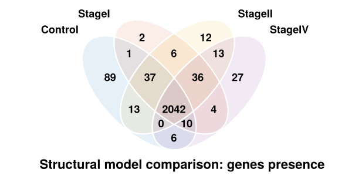
        <figcaption><strong>Figure7:</strong> Inter and outersection of genes between the models. </figcaption>
    </figure>


=== "rxns in the model"

    `showFigure(BRCAProject.comparisons.(comparisonName).structuralComparison.plots.intersections.rxns)`

    <figure>
        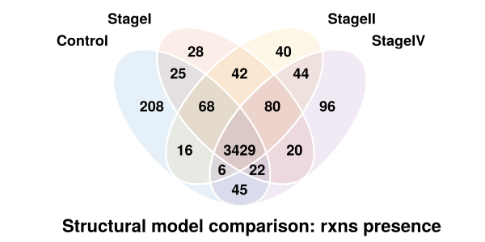
        <figcaption><strong>Figure8:</strong> Inter and outersection of reactions between the models.</figcaption>
    </figure>

=== "metabolites in the model"

    `showFigure(BRCAProject.comparisons.(comparisonName).structuralComparison.plots.intersections.mets)`
    <figure>
        
        <figcaption><strong>Figure9:</strong> Inter and outersection of metabolites between the models.</figcaption>
    </figure>


Similarity between the model defined by the Jaccard Similarity (1-Jaccard Distance):

=== "genes in the model"

    `showFigure(BRCAProject.comparisons.(comparisonName).structuralComparison.plots.jaccardDist.genes)`
    <figure>
        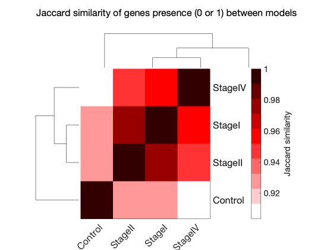
        <figcaption><strong>Figure10:</strong> Jaccard similarity between models, based on gene presence. </figcaption>
    </figure>


=== "rxns in the model"

    `showFigure(BRCAProject.comparisons.(comparisonName).structuralComparison.plots.jaccardDist.rxns)`
    <figure>
        
        <figcaption><strong>Figure11:</strong> Jaccard similarity between models, based on gene presence.</figcaption>
    </figure>

=== "metabolites in the model"

    `showFigure(BRCAProject.comparisons.(comparisonName).structuralComparison.plots.jaccardDist.mets)`
    <figure>
        
        <figcaption><strong>Figure12:</strong> Jaccard similarity between models, based on gene presence.</figcaption>
    </figure>


The overlap between the models per subsystem in absolute(numbers writen in the tile) & relative numbers(coloring of the tiles) in context of the pathway size (#rxns):

`showFigure(BRCAProject.comparisons.(comparisonName).structuralComparison.plots.reactionPathwayPresence)`
<figure>
    
     <figcaption style="width: 100%; text-align: center;">
    <strong>Figure13:</strong> Overview of the rxns presence and overlap per subsystem and model. On the left the number of rxns per subsystem in the reference model are shown. On the right the colorcode gives an impression how many of the rxns from the reference model made it into the 4 context specific models and the numbers are the absolute number of rxns in each of the subsystems for each of the models. The subsystems with the most variance in absolute number of rxns between the models are displayed on the top. This gives us an impression about how big the changes between the models are at one hand in absolute rxn numbers but also relative to the size of the subsystem. </figcaption>
</figure>


__Functional Model Comparison:__

The functional comparison ansers the following question: 

+ How different are the FVA boundaries of the model ? 
+ Are there differences in the rxn/met usage (fluxsum) per subsystem between the models ? 
+ Are there differences in the rxn usage (cardinality) per subsystem between the models ?

=== "Similarity of FVA boundaries"

    `showFigure(BRCAProject.comparisons.(comparisonName).functionalComparison.plots.fvaSim.overall)`

    <figure>
        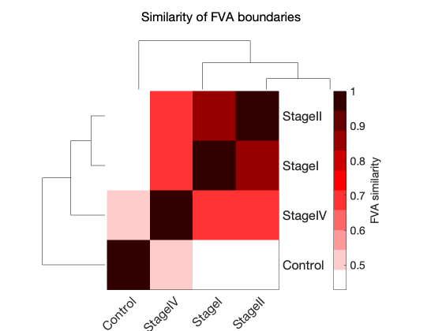
        <figcaption><strong>Figure14:</strong> Similarity based on the FVA boundaries.</figcaption>
    </figure>

=== "Usage of Rxns (Fluxsum) per Subsystems per Model"

    `showFigure(BRCAProject.comparisons.(comparisonName).functionalComparison.plots.fba.heatmapRxnFluxsum)`

    <figure>
        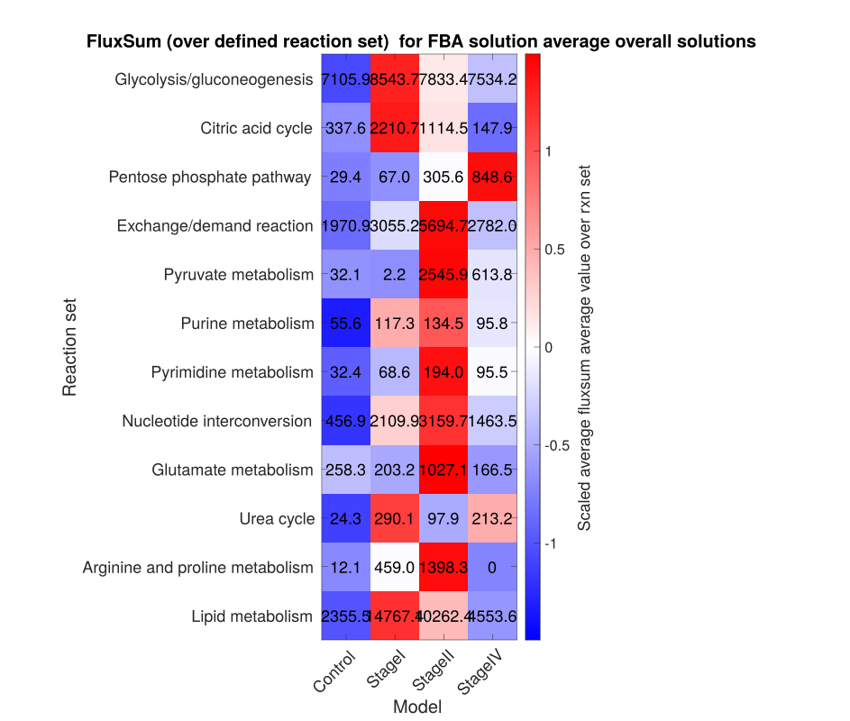
        <figcaption><strong>Figure15:</strong> Fluxsum over all reactions per subsystem and model. Baed on fluxes of FBA solution. </figcaption>
    </figure>

=== "Usage of Mets (Fluxsum) per Subsystems per Model"

    `showFigure(BRCAProject.comparisons.(comparisonName).functionalComparison.plots.fba.heatmapMetsFluxsum)`

    <figure>
        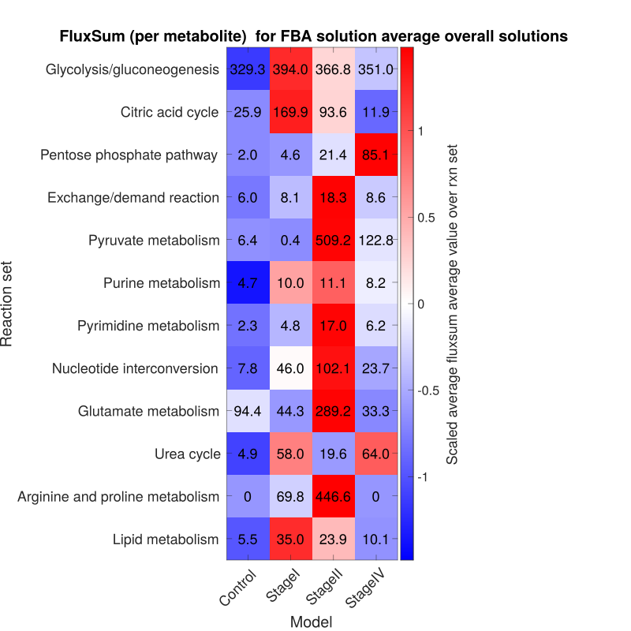
        <figcaption><strong>Figure16:</strong> Fluxsum over all metabolites per subsystem and model. Based on fluxes of FBA solution.</figcaption>
    </figure>

=== "Usage of Rxns (Cardinality) per Subsystem per Model"

    `showFigure(BRCAProject.comparisons.(comparisonName).functionalComparison.plots.fba.heatmapRxnActivityFba)`

    <figure>
        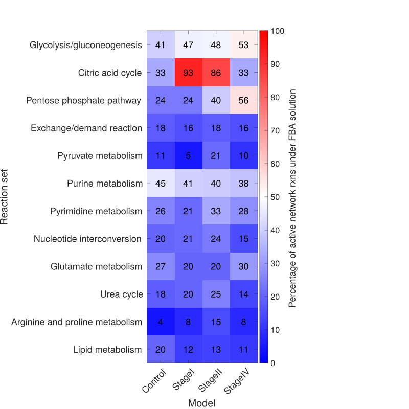
        <figcaption><strong>Figure17:</strong> Visualization of the Cardinality per subsystem and model. Based on the Cardinality in FBA solution.</figcaption>
    </figure>


__Sampling Comparison:__

The sampling comparison investigates the whole solution space using sampling (by default CHRR). 
The aim of this approach is to not only see the the max and min capacity, like in FVA but also see what the likelyhood of the flux values given by the sampling distribution. In the next step, not implemented yet, we'd like to visualize the correlation structure between the rxns.
As seen in the previous figure visualizing the Cardinality of each subsystem, less than half of the rxns are active in the FBA solution. In cases where the subsystem of interest is not active in the FBA optimizing for the biomass_reaction, FBA can only provide limited to no insights. 
Therefore investigating the whole solution space under a constraint for the biomass (by default 90% of the biomass = ub) gives the opportunity to investigate the whole metabolic model. 
Additionally, the sampling analysis can give an impression of the stability of the values seen under the FBA solution, since the FBA solution only gives one optimal value we have no information of how stable this value is.

=== "Fluxsum over Rxns"

    `showFigure(BRCAProject.comparisons.(comparisonName).samplingComparison.plots.heatmapRxnFluxSum)`

    <figure>
        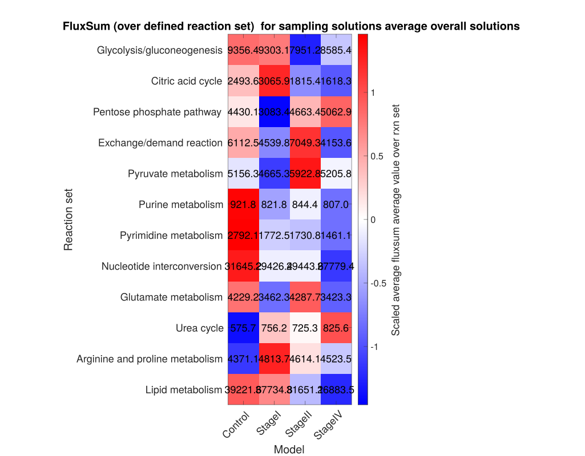
        <figcaption><strong>Figure18:</strong> Average of Fluxsum over all reaction in the subsystem and model. Based on the sampling solutions.</figcaption>
    </figure>

=== "subfigure"

    `showFigure(BRCAProject.comparisons.(comparisonName).samplingComparison.plots.heatmapRxnFluxSumSamples)`

    <figure>
        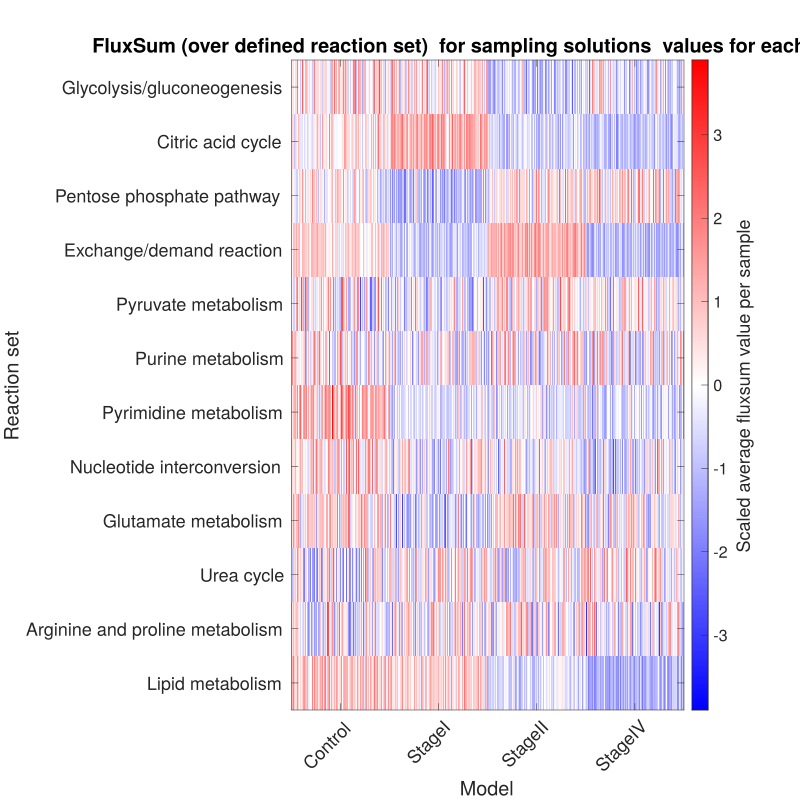
        <figcaption><strong>Figure19:</strong> Fluxsum over all reactions in the subsystem and sample. Based on the sampling solutions.</figcaption>
    </figure>

=== "subfigure"

    `showFigure(BRCAProject.comparisons.(comparisonName).samplingComparison.plots.heatmapMetsFluxSum)`

    <figure>
        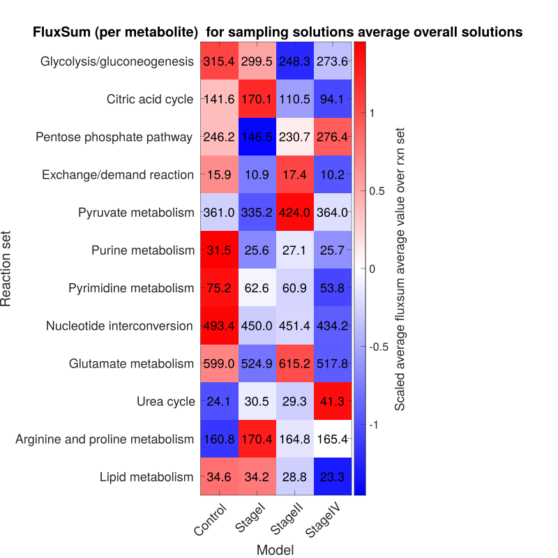
        <figcaption><strong>Figure20:</strong> Average of Fluxsum over all metabolites in the subsystem and model. Based on the sampling solutions.</figcaption>
    </figure>

=== "subfigure"

    `showFigure(BRCAProject.comparisons.(comparisonName).samplingComparison.plots.heatmapMetsFluxSumSamples)`

    <figure>
        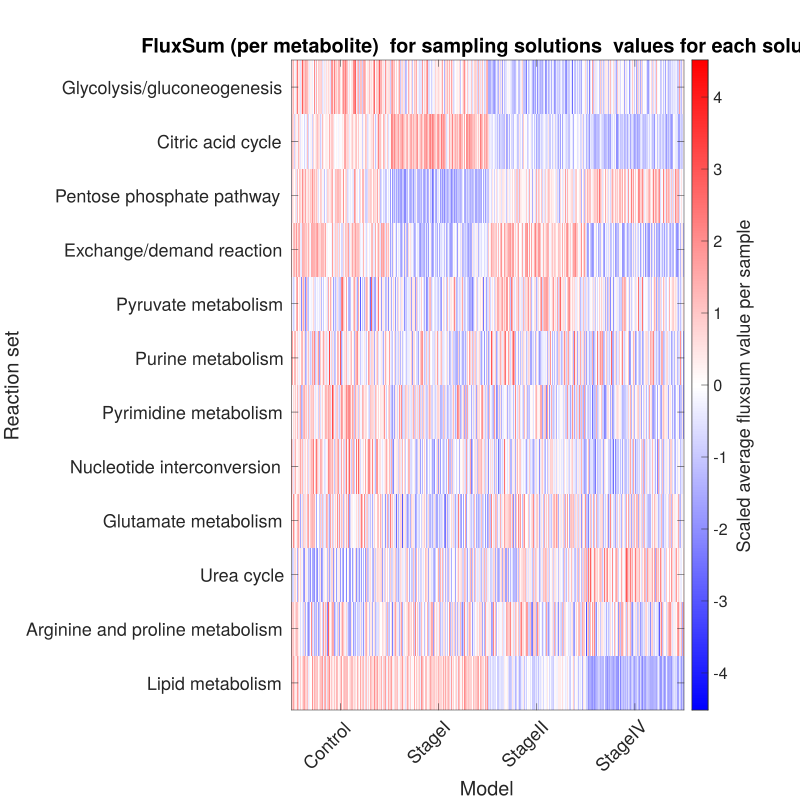
        <figcaption><strong>Figure21:</strong> Fluxsum over all metabolites in the subsystem and sample. Based on the sampling solutions.</figcaption>
    </figure>


### Explorative model comparison with Tackel MMe

<figure>
        
        <figcaption><strong>Figure22:</strong> Overview on how to use the functions provided by TackleMMe to explore your models.</figcaption>
</figure>


!!! note "Upcoming features"
    The following are planned for future integration:

    - **IDARE output** — generation of interactive pathway visualizations using the IDARE toolbox
    - **Report generation** — automated PDF report for model comparisons, similar to `writeAnalysisReport` for single model analysis